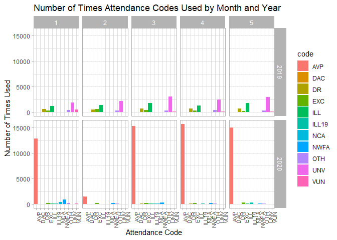
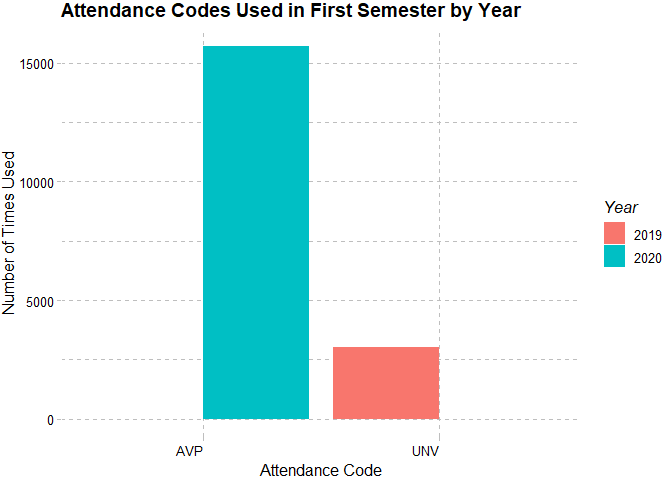

```r
if (!require("tidyverse")) install.packages('tidyverse')
```

```
## Loading required package: tidyverse
```

```
## -- Attaching packages --------------------------------------- tidyverse 1.3.0 --
```

```
## v ggplot2 3.3.3     v purrr   0.3.4
## v tibble  3.0.6     v dplyr   1.0.4
## v tidyr   1.1.2     v stringr 1.4.0
## v readr   1.4.0     v forcats 0.5.1
```

```
## -- Conflicts ------------------------------------------ tidyverse_conflicts() --
## x dplyr::filter() masks stats::filter()
## x dplyr::lag()    masks stats::lag()
```


```r
library(tidyverse)
library(rmarkdown)
library(shiny)
library(shinydashboard)
```

```
## 
## Attaching package: 'shinydashboard'
```

```
## The following object is masked from 'package:graphics':
## 
##     box
```

```r
library(skimr)
library(janitor)
```

```
## 
## Attaching package: 'janitor'
```

```
## The following objects are masked from 'package:stats':
## 
##     chisq.test, fisher.test
```

```r
library(here)
```

```
## here() starts at C:/Users/Jessica/Desktop/groupwork
```

```r
library(RColorBrewer)
library(paletteer)
library(ggthemes)
library(naniar)
```

```
## 
## Attaching package: 'naniar'
```

```
## The following object is masked from 'package:skimr':
## 
##     n_complete
```

```r
library(dplyr)
library(ggpubr)
library(ggplot2)
library(here)
options(scipen=999)
```


##Data Sets

#Attendance Rates by Month Data Loading and Manipulation


```r
attrates<- readr::read_csv("data/att_rates.csv")
```

```
## 
## -- Column specification --------------------------------------------------------
## cols(
##   Year = col_double(),
##   Month = col_double(),
##   `Attendance Rate %` = col_double(),
##   student_add = col_double(),
##   student_drop = col_double(),
##   `number of students` = col_double()
## )
```

```r
attrates<- janitor::clean_names(attrates)
attrates$year<- as.factor(attrates$year)
attrates$month<- as.factor(attrates$month)
attrates
```

```
## # A tibble: 10 x 6
##    year  month attendance_rate_perce~ student_add student_drop number_of_studen~
##    <fct> <fct>                  <dbl>       <dbl>        <dbl>             <dbl>
##  1 2019  1                       96.0          22           12               973
##  2 2019  2                       96.4           8           22               969
##  3 2019  3                       95            15           13               962
##  4 2019  4                       93.7           8           19               957
##  5 2019  5                       93.6           8           19               946
##  6 2020  1                       88.6          20            6               929
##  7 2020  2                       88.6          17            6               939
##  8 2020  3                       94.3           7            4               940
##  9 2020  4                       94.6           8            6               944
## 10 2020  5                       92.5           1            6               939
```

```r
#This data set shows the percent of student attendance for attendance months 1-5 by year. This also shows the number of students that both enrolled and withdrew from the school site in each of these months along with the total number of enrollment at each of these months. (Note: the months are attendance months rather than calendar months)
```


```r
attrates_long <- attrates %>% 
  pivot_longer(
    3:6,
    names_to="attendance_statistic",
    values_to="value"
  )
attrates_long
```

```
## # A tibble: 40 x 4
##    year  month attendance_statistic    value
##    <fct> <fct> <chr>                   <dbl>
##  1 2019  1     attendance_rate_percent  96.0
##  2 2019  1     student_add              22  
##  3 2019  1     student_drop             12  
##  4 2019  1     number_of_students      973  
##  5 2019  2     attendance_rate_percent  96.4
##  6 2019  2     student_add               8  
##  7 2019  2     student_drop             22  
##  8 2019  2     number_of_students      969  
##  9 2019  3     attendance_rate_percent  95  
## 10 2019  3     student_add              15  
## # ... with 30 more rows
```

```r
#write.csv(attrates_long, "data/attrateslong.csv")
```

#Attendance Codes by Year Loading and Manipulation


```r
attreason <- readr::read_csv("data/att_reason_reports.csv")
```

```
## 
## -- Column specification --------------------------------------------------------
## cols(
##   year = col_double(),
##   DR = col_double(),
##   ILL = col_double(),
##   EXC = col_double(),
##   UNV = col_double(),
##   VUN = col_double(),
##   OTH = col_double(),
##   AVP = col_double(),
##   ILL19 = col_double(),
##   NWFA = col_double(),
##   DAC = col_double(),
##   NCA = col_double(),
##   total = col_double()
## )
```

```r
attreason
```

```
## # A tibble: 2 x 13
##    year    DR   ILL   EXC   UNV   VUN   OTH   AVP ILL19  NWFA   DAC   NCA total
##   <dbl> <dbl> <dbl> <dbl> <dbl> <dbl> <dbl> <dbl> <dbl> <dbl> <dbl> <dbl> <dbl>
## 1  2020   243   246   970     0    63   457 73543   588  1625    99   515 78349
## 2  2019  3226  7484  1822 12433   923  1833     0     0     0     0     0 27721
```


```r
attcodes<- attreason%>%
  pivot_longer(-year, names_to = "att_code", values_to = "occurence")
attcodes$year<- as.factor(attcodes$year)
attcodes
```

```
## # A tibble: 24 x 3
##    year  att_code occurence
##    <fct> <chr>        <dbl>
##  1 2020  DR             243
##  2 2020  ILL            246
##  3 2020  EXC            970
##  4 2020  UNV              0
##  5 2020  VUN             63
##  6 2020  OTH            457
##  7 2020  AVP          73543
##  8 2020  ILL19          588
##  9 2020  NWFA          1625
## 10 2020  DAC             99
## # ... with 14 more rows
```

```r
#This dataset shows the usage of attendance codes by year. These attendance codes are used when we enter the reason behind an absence. Some, such as DR, ILL, are excused while others like UNV, and VUN are not excused. These factor in when it comes to determining our attendance percentages. The codes ILL19, AVP, NWFA, DAC, and NCA were introduced for virtual/distance learning due to the pandemic. 
```


#Attendance Codes by Month & Year Loading and Manipulation


```r
codesmonth<- readr::read_csv("data/attendance codes by month.csv")
```

```
## 
## -- Column specification --------------------------------------------------------
## cols(
##   Year = col_double(),
##   Month = col_double(),
##   Code = col_character(),
##   used = col_double()
## )
```

```r
codesmonth<- janitor::clean_names(codesmonth)
codesmonth$month <- as.factor(codesmonth$month)
codesmonth$year <- as.factor(codesmonth$year)
codesmonth
```

```
## # A tibble: 110 x 4
##    year  month code   used
##    <fct> <fct> <chr> <dbl>
##  1 2019  1     DR      639
##  2 2019  1     ILL    1231
##  3 2019  1     EXC     290
##  4 2019  1     UNV    1839
##  5 2019  1     VUN     473
##  6 2019  1     OTH     459
##  7 2019  1     AVP       0
##  8 2019  1     ILL19     0
##  9 2019  1     NWFA      0
## 10 2019  1     DAC       0
## # ... with 100 more rows
```

```r
#This dataset shows the usage of attendance codes by month and year rather than showing the total counts for each code by year (as seen above in "attcodes"). 
```


```r
codesmonth_wide <- codesmonth %>% 
  pivot_wider(
    names_from = "code",
    values_from = "used"
  )
codesmonth_wide
```

```
## # A tibble: 10 x 13
##    year  month    DR   ILL   EXC   UNV   VUN   OTH   AVP ILL19  NWFA   DAC   NCA
##    <fct> <fct> <dbl> <dbl> <dbl> <dbl> <dbl> <dbl> <dbl> <dbl> <dbl> <dbl> <dbl>
##  1 2019  1       639  1231   290  1839   473   459     0     0     0     0     0
##  2 2019  2       549  1380   610  2170    64   336     0     0     0     0     0
##  3 2019  3       673  1814   426  3007   118   316     0     0     0     0     0
##  4 2019  4       667  1304   305  2421   127   429     0     0     0     0     0
##  5 2019  5       698  1755   191  2996   141   293     0     0     0     0     0
##  6 2020  1        10    45   191     0    63   157 12777    92   851    35   401
##  7 2020  2        26    42   176     0     0   126  1487    35   230     0    40
##  8 2020  3        81    75   211     0     0    23 15215    87   285     0    62
##  9 2020  4       107    28   143     0     0    72 15684    60   166     0     7
## 10 2020  5        19    56   249     0     0    79 14996   314    93     0     5
```


```r
codes_summary <- codesmonth%>%
  group_by(code, year)%>%
  summarise(total=sum(used))
```

```
## `summarise()` has grouped output by 'code'. You can override using the `.groups` argument.
```


##Data Analysis


#Attendance Rates, Enrollments and Withdrawals by Year 


```r
attrates_long <- readr::read_csv("attrateslong.csv")
```

```
## Warning: Missing column names filled in: 'X1' [1]
```

```
## 
## -- Column specification --------------------------------------------------------
## cols(
##   X1 = col_double(),
##   year = col_double(),
##   month = col_double(),
##   attendance_statistic = col_character(),
##   value = col_double()
## )
```

```r
ui <- dashboardPage(skin ="black",
    dashboardHeader(title = "Attendance Data"),
    dashboardSidebar(disable = T),
    dashboardBody(
        fluidRow(
            box(title = "Plot Options", width = 3,
                selectInput("x", "Select Term", choices = c("attendance_rate_percent", "student_add", "student_drop"),
                            selected = "attendance_rate_percent"),
            ), # close the first box
            box(title = "Attendance Rates, Enrollment and Withdrawal Data by Month", width=8,
                plotOutput("plot", width = "700px", height = "500px")
            ) # close the second box
        ) # close the row
    ) # close the dashboard body
) # close the ui
server <- function(input, output, session) { 
    output$plot <- renderPlot({
        attrates_long %>% 
            filter(attendance_statistic==input$x) %>% 
            ggplot(aes(x=month, y=value)) +
            geom_col(color="black", fill="darkcyan", alpha=.5)+
            facet_wrap(~year)+
            #geom_col(color="black", fill="slateblue2", alpha=1)+
            theme_gdocs()+
            labs(x="Month",y="Count")
        
    })
    
    # stop the app when we close it
    session$onSessionEnded(stopApp)
}
shinyApp(ui, server)
```

`<div style="width: 100% ; height: 400px ; text-align: center; box-sizing: border-box; -moz-box-sizing: border-box; -webkit-box-sizing: border-box;" class="muted well">Shiny applications not supported in static R Markdown documents</div>`{=html}

```r
#This shinyApp shows the attendance rates, enrollment and withdrawals by month and year. At first sight, there does not appear to be many differences between the two years. We decided to do a deeper analysis into the attendance rates that are used to determine the actual attendance rates. 
```


#Attendance Code Usage by Month and Year


```r
p<- codesmonth%>%
  ggplot(aes(x=code, y=used, fill=code))+
  geom_col()+
  facet_grid(year~month)
```


```r
p+theme_light()+
  theme(axis.text.x = element_text(angle = 90, hjust=1, size = 8))+
  labs(title = "Number of Times Attendance Codes Used by Month and Year",
       x = "Attendance Code",
       y= "Number of Times Used")
```

<!-- -->

```r
#Here we can see a comparison of the number of times that each attendance code was used by month and year. The high number of AVP's immediately stands out. These are the main type of unexcused absence for the year 2020. 
```


```r
codessubset<- subset(codesmonth, code==c("AVP","UNV"))
```


```r
p2<- codessubset%>%
  ggplot(aes(x=code, y=used, fill=year))+
  geom_col(position="dodge")
```


```r
p2+theme_pander()+
  theme(axis.text.x = element_text(angle = 0, hjust=1))+
  labs(title = "Attendance Codes Used in First Semester by Year",
       x = "Attendance Code",
       y= "Number of Times Used",
       fill= "Year")
```

<!-- -->

```r
#AVP stands for "absent virtual participation"; this essentially means that the student was absent from their class period for an unknown reason (no parent contact, Dr note, etc). This code was introduced in 2020 due to the shift to distance learning. In regular year, an unknown reason for an absence is documented using the code UNV which stands for unverified. This plot is showing the dramatic increase in total number of unknown absences for the first semester of 2020 vs the total number for the first semester of 2019. With all of these absences, we were curious to see what the impact was on academic performance. 
```

##First Semester GPA by Grade Level and Year


```r
gpa_2_long <- readr::read_csv("gpa_2_long.csv")
```

```
## Warning: Missing column names filled in: 'X1' [1]
```

```
## 
## -- Column specification --------------------------------------------------------
## cols(
##   X1 = col_double(),
##   year = col_double(),
##   grade = col_double(),
##   cumulative_gpa = col_double(),
##   term = col_double(),
##   gpa = col_double()
## )
```

```r
ui <- dashboardPage(skin ="black",
    dashboardHeader(title = "GPA Shiny App"),
    dashboardSidebar(disable = T),
    dashboardBody(
        fluidRow(
            box(title = "Plot Options", width = 2,
                radioButtons("x", "Select Grade", choices = c("6", "7", "8"), 
                             selected = "6"),
                radioButtons("y", "Select Term", choices = c("1", "2"),
                             selected = "1"),
                radioButtons("z", "Select Year", choices = c("2019", "2020"),
                             selected = "2019"),
            ), # close the first box
            box(title = "GPA Data From Years 19-20 and 20-21", width=8,
                plotOutput("plot", width = "700px", height = "500px")
            ) # close the second box
        ) # close the row
    ) # close the dashboard body
) # close the ui

server <- function(input, output, session) { 
    
    output$plot <- renderPlot({
        gpa_2_long %>% 
            filter(grade==input$x & term==input$y & year==input$z) %>% 
            ggplot(aes(x=gpa, fill=year)) +
            geom_density(color="black", fill="darkcyan", alpha=.5)+
            theme_gdocs()+
            labs(x="GPA", y="Student Count")
        
    })
    
    # stop the app when we close it
    session$onSessionEnded(stopApp)
}

shinyApp(ui, server)
```

`<div style="width: 100% ; height: 400px ; text-align: center; box-sizing: border-box; -moz-box-sizing: border-box; -webkit-box-sizing: border-box;" class="muted well">Shiny applications not supported in static R Markdown documents</div>`{=html}

```r
#Term 1 represents progress report grades and Term 2 is the final semester grade received. This shinyApp shows the trends for each grade level by term and year. 
```


